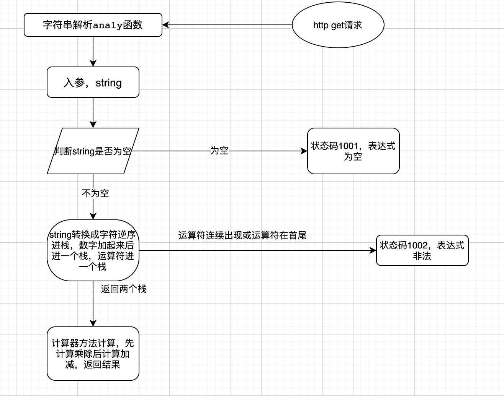

<h1 align="center">技术文档</h1>

## 1.整体框架

整体实现思路：

1.设计一个栈类型的数据结构，包含Size，Push，Pop，Top等方法

2.设计计算器方法，先运行* ，/，在运行+，-

3.设计gin服务框架

4.单元测试和压力测试

## 2.目录结构

```

.
├── Readme.md
├── __pycache__
│   └── locustfile.cpython-39.pyc
├── app
│   ├── Service
│   │   └── httpServer.go
│   ├── app
│   ├── main.go
│   └── model
│       └── stack.go
├── day2压力测试.html
├── go.mod
├── go.sum
├── internal
│   ├── ctrl
│   │   └── api.go
│   ├── globalError.go
│   ├── handler
│   │   ├── counter.go
│   │   └── counter_test.go
│   └── router
│       └── router.go
├── locustfile.py
└── 流程图.png


```

## 3.代码逻辑分层

| 层        | 文件夹                            | 主要职责           | 调用关系                    | 其他说明     |
| --------- | --------------------------------- | ------------------ | --------------------------- | ------------ |
| 应用层    | /app/app                          | 服务器启动         | 调用service层               | 不可同层调用 |
| 路由层    | /internal/router/router.go        | 路由转发           | 被service层调用，调用控制层 | 不可同层调用 |
| 控制层    | /internal/ctrl/api.go         | 请求参数处理，响应 | 被路由层调用，调用handler   | 不可同层调用 |
| handler层 | /internal/handler/counter.go      | 处理具体业务       | 被控制层调用                | 不可同层调用 |
| 压力测试  | locustfile.py                     | 进行压力测试       | 无调用关系                  | 不可同层调用 |
| service层 | /app/Service/httpService.go       | 启动路由           | 被应用层调用，调用路由层    | 不可同层调用 |
| 单元测试  | /internal/handler/counter_test.go | 进行单元测试       | 无调用关系                  | 不可同层调用 |


## 4.存储设计

自己设计的栈：定义一个栈接口，里面有Push，Pop，Top，Size方法，对象为切片类型

## 5.接口设计

### 请求方法

Http GET

请求路径

| 接口地址                      | 请求参数 | 接口说明           |
| ----------------------------- | -------- | ------------------ |
| http://localhost:8000/Counter | string   | 输入字符串计算数值 |

响应状态码

| 状态码 | 说明       |
| ------ | ---------- |
| 无     | 成功       |
| 1001   | 表达式为空 |
| 1002   | 表达式非法 |


## 6、第三方库

```
"strconv"
"net/http"
"strings"
"github.com/gin-gonic/gin"
```

## 7.如何编译执行

cd app

go build

./app

编译为可执行文件

cd internal

cd handler

go test

单元测试

locust 

压力测试

## 8、todo

将项目进一步划分，方便拓展


